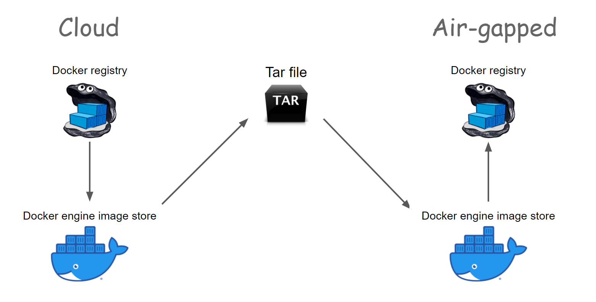

# docker-charon

Transfer your Docker images to an air-gapped system efficiently.

(An air-gapped system is a system that is not connected to the internet)


From wikipedia:

> In Greek mythology, Charon or Kharon (/ˈkɛərɒn, -ən/; Ancient Greek: Χάρων) is a 
> psychopomp, the ferryman of Hades who carries souls of the newly deceased 
> who had received the rites of burial, across the river Acheron 
> (or in some later accounts, across the river Styx) that 
> divided the world of the living from the world of the dead.

## Installation
```bash
pip install docker-charon
```

## Example


#### Use as a command line

```

```


```python
from docker_charon import make_payload

make_payload(
    "86541248189.dkr.ecr.eu-west-2.amazonaws.com",
    "./payload.zip",
    docker_images_to_transfer=["my-image:1.8", "my-other-image:1.5"],
    docker_images_already_transferred=["my-image:1.4", "my-other-image:1.3"],
    username="docker_username",
    password="docker_password"
)
```

```python
from docker_charon import push_payload

docker_images_transferred = push_payload(
    "localhost:5000",
    "./payload.zip",
    secure=False
)
```

## Functions signatures:

### make_payload

Creates a payload from a list of docker images

All the docker images must be in the same registry.
This is currently a limitation of the docker-charon package.

If you are interested in multi-registries, please open an issue.

##### Arguments

- **registry**: The registry to pull the images from. The name of the registry
    must not be included in `docker_images_to_transfer` and
    `docker_images_already_transferred`.
- **zip_file**: The path to the zip file to create. It can be a `pathlib.Path` or
    a `str`. It's also possible to pass a file-like object. The payload with
    all the docker images is a single zip file.
- **docker_images_to_transfer**: The list of docker images to transfer. Do not include
    the registry name in the image name.
- **docker_images_already_transferred**: The list of docker images that have already
    been transferred to the air-gapped registry. Do not include the registry
    name in the image name. It's optional but if you use it, you can make the 
    payload a lot smaller.
- **secure**: Set to `False` if the registry doesn't support HTTPS (TLS). Default
    is `True`.
- **username**: The username to use for authentication to the registry. Optional if
    the registry doesn't require authentication.
- **password**: The password to use for authentication to the registry. Optional if
    the registry doesn't require authentication.


### push_payload_to_registry

Push the payload to the registry.

It will iterate over the docker images and push the blobs and the manifests.

##### Arguments

- **registry**: the registry to push to.
- **zip_file**: the zip file containing the payload. It can be a `pathlib.Path`, a `str`
    or a file-like object.
- **strict**: `False` by default. If True, it will raise an error if the 
     some blobs/images are missing.
     That can happen if the user set an image in `docker_images_already_transferred`
     that is not in the registry.
- **secure**: whether to use TLS (HTTPS) or not to connect to the registry,
    default is `True`.
- **username**: the username to use to connect to the registry. Optional
    if the registry does not require authentication.
- **password**: the password to use to connect to the registry. Optional
    if the registry does not require authentication.

##### Returns

The list of docker images loaded in the registry.

It also includes the list of docker images that were already present
in the registry and were not included in the payload to optimize the size.
In other words, it's the argument `docker_images_to_transfer` that you passed
to the function `docker_charon.make_payload(...)`.


## Why such a package?

#### The usual method: docker save and load

It's a problem where a simple solution already exists. 
You can use the `docker save` and `docker load` commands to transfer your images to an air-gapped system with a tar.
This is actually what is recommended for simple use cases.

Here is the recap of the `docker pull -> docker save -> docker load -> docker push` method:




But let's say that you want to scale your deliveries, make regular updates, you'll soon 
notice issues with `docker save` and `docker load`:
* Speed when making the payload: The images must be pulled from the registry. Unpacked by the Docker engine, repacked again in a tar file. This is a LOT of disk access.
* Speed when loading the payload: The tar file is unpacked by the Docker engine. Then you can push the images to the registry. This involves a lot of unpacking and repacking of layers.
* Size of the payload. `docker save` take all the layers and images you declare. 
    Even if some images and layers are already present in the air-gapped system.

#### The docker-charon method:

Docker-charon is a package that addresses these issues. 

It reads the registry directly to make the payload.
You don't even need docker on the machine making the payload and the machine loading the payload.

It can also compute the diff in a smart way if you provide the images already present in the 
air-gapped system registry. That means much smaller payloads because some layers are not 
transferred a second time.

Here is the recap of the docker-charon method:


### How does it work?

docker-charon will query the registry, get the manifests of the docker images,
and then will only download the blobs that were not transferred yet to the 
air-gapped registry.

Everything is put in a single zip. Zip files are a good choice because it's 
possible to randomly access files within it and then decompress them in 
whatever order is needed.

When in the air-gapped system, the `push_payload_to_registry` function will
read the zip file index and push the blobs and the manifests to the registry on the fly.

The Docker images are then ready to be pulled in your air-gapped cluster!
